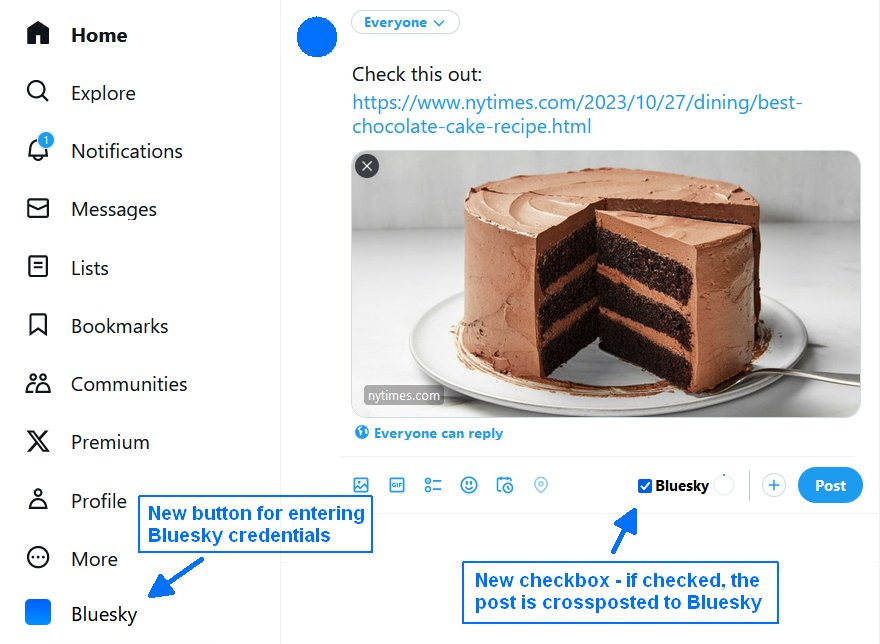

# twitter-to-bsky - crosspost from Twitter/X to Bluesky

twitter-to-bsky is a [userscript](https://en.wikipedia.org/wiki/Userscript) written for [Violentmonkey](https://violentmonkey.github.io/get-it/) running in desktop web browsers (Chrome/Firefox/Edge).

It allows to automatically crosspost to [Bluesky](https://bsky.app/) when writing posts in the [Twitter/X](https://twitter.com/) web application in a desktop browser.

While crossposting is generally considered a bad practice, in this case it makes sense, its purpose is to ease the transistion from X to Bluesky while there a still many users left that havn't followed on the new platform yet.

Crossposting obviously only makes sense for generic posts that e.g. link to a news article or blog post, but not for replies, mentions, DMs etc. which are Twitter/X-specific.

**Features**

twitter-to-bsky supports plain text posts, posts with one or several attached images and posts containing a media card, based on some entered URL. Videos/GIFs are not supported, because Bluesky doesn't support them yet.

**Setup**

Install and activate the [Violentmonkey](https://violentmonkey.github.io/get-it/) browser addon, then open [this URL - the userscript](https://github.com/59de44955ebd/twitter-to-bsky/raw/main/twitter-to-bsky.user.js) in the browser and allow Violentmonkey to install it.

If you now (re-)load the Twitter/X page, it will be "enhanced" with the following new elements:
* a blue Bluesky button at the bottom of the navigation bar that allows to enter your Bluesky credentials (see "App password" below) in a small popup dialog.
* a "Bluesky" checkbox in the toolbar of the new post area (both inline and dialog). If the checkbox is checked, pressing the "Post" button will send the same post also to Bluesky.

**App password**

The password you have to enter in the Bluesky settings dialog (see above) is **not** your actual Bluesky password, but instead a so called "app password", in the Bluesky web app navigate to Settings -> Advanced -> App Passwords and create a new app password with a single click, then copy it and paste it into the "Bluesky App Password" field of this popup dialog, enter your full Bluesky handle (i.e. including ".bsky.social") into the "Bluesky Handle" field and save the changes.

**Screenshot**

*Twitter/X enhanced with Bluesky buttons*  

