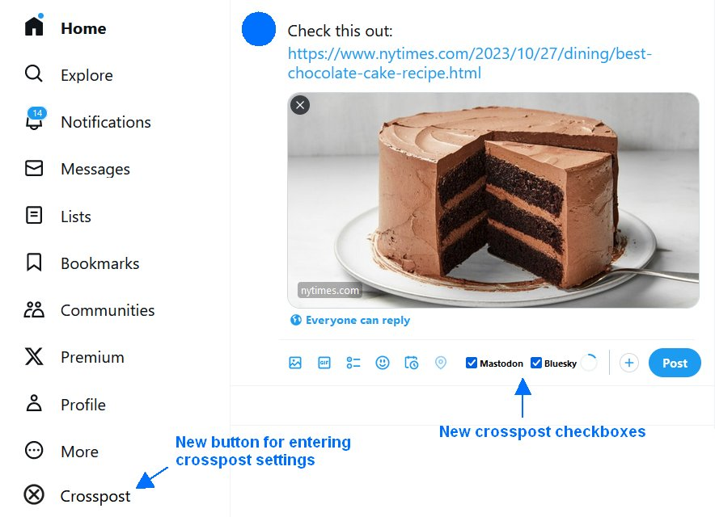
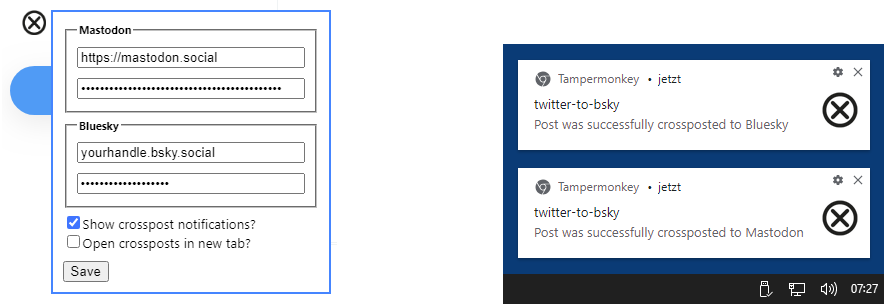

# twitter-to-bsky - crosspost from Twitter/X to Bluesky and Mastodon

twitter-to-bsky is a [userscript](https://en.wikipedia.org/wiki/Userscript) written for [Tampermonkey](https://www.tampermonkey.net/) or [Violentmonkey](https://violentmonkey.github.io/get-it/) running in desktop web browsers (Chrome/Firefox/Edge).

It allows to automatically crosspost to [Bluesky](https://bsky.app/) and/or [Mastodon]() when writing posts in the [Twitter/X](https://twitter.com/) web application in a desktop browser.

While crossposting is generally considered a bad practice, in this case it makes sense, its purpose is to ease the transistion from X to Bluesky or Mastodon while there a still many users left that havn't followed on the new platform yet.

Crossposting obviously only makes sense for generic posts that e.g. link to a news article or blog post, but not for replies, mentions, DMs etc. which are Twitter/X-specific.

## Features

twitter-to-bsky supports plain text posts, posts with one or several attached media files and posts containing a preview card, based on some entered URL. Note that Bluesky doesn't support videos/GIFs yet.

## Setup

Install and activate either the [Tampermonkey](https://www.tampermonkey.net/) or [Violentmonkey](https://violentmonkey.github.io/get-it/) browser addon, then open [this URL - the userscript](https://github.com/59de44955ebd/twitter-to-bsky/raw/main/twitter-to-bsky.user.js) in the browser and allow the addon to install it as new userscript.

If you now (re-)load the Twitter/X page, it will be "enhanced" with the following new elements:
* a black cross button at the bottom of the navigation bar that allows to enter your Mastodon and/or Bluesky credentials in a small popup dialog (see details below).
* "Mastodon" and "Bluesky" checkboxes in the toolbar of the new post area (both inline and dialog). If a checkbox is checked, pressing the "Post" button will send the same post also to the corresponding platform.

### Mastodon settings
* "Mastodon Instance URL" is the base URL of your Mastodon instance, e.g. "https://mastodon.social".
* "Mastodon API Key" is an access token that you can create in the Mastodon web app via Settings -> Development -> New application.

### Bluesky settings
* "Bluesky Handle" is your full handle, including ".bsky.social".
* "Bluesky App Password" is **not** your main Bluesky password, but instead a so called "app password", in the Bluesky web app navigate to Settings -> Advanced -> App Passwords and create a new app password with a single click, then copy it and paste it into this field and save the changes.

## Screenshots

*Twitter/X enhanced with crosspost elements*

*Settings dialog and system notifications (Windows 11)*

